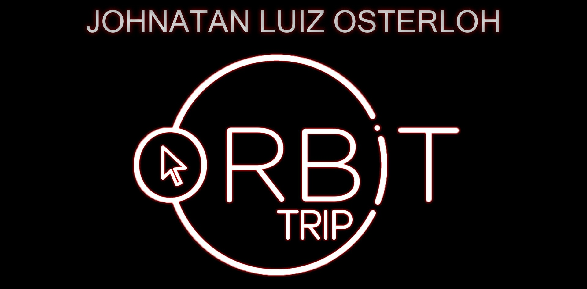

<h1 align="center">
    
    <br>
    Ecoleta
</h1>

<h4 align="center">
  Sistema desenvolvido na semana NLW da Rocketseat utilizando a tecnologia Javascript e SQLite.
</h4>

<p align="center">
  <a href="#descrição">Descrição</a>&nbsp;&nbsp;&nbsp;|&nbsp;&nbsp;&nbsp;
  <a href="#tecnologias">Tecnologias</a>&nbsp;&nbsp;&nbsp;|&nbsp;&nbsp;&nbsp;
  <a href="#Como-Usar">Como Usar</a>&nbsp;&nbsp;&nbsp;|&nbsp;&nbsp;&nbsp;
  <a href="#ferramentas">Ferramentas</a>
</p>

<p align="center">
  
</p>

## Descrição

Este projeto foi desenvolvido durante a semana NLW (Next Level Week) da [Rocketseat](https://rocketseat.com.br/), com o intúito de apresentar os conceitos e técnicas de desenvolvimento de páginas web utilizando as tecnologias Javascript, SQLite e como consumir uma API de serviços.
Para a consulta a listagem de Estados e Cidades, está sendo utilizado a API do [IBGE](https://servicodados.ibge.gov.br/api/docs/localidades?versao=1). E os dados informados na aplicação estão sendo gravados em uma Base de Dados SQLite a qual é uma biblioteca que implementa um banco de dados embutido.

## Tecnologias

Neste projeto foram utilizadas as seguintes tecnologias:

- [SQLite](https://www.sqlite.org/)
- [Nunjucks](https://mozilla.github.io/nunjucks/)

## Ferramentas

- [Node.js](https://nodejs.org/)
- [Yarn](https://yarnpkg.com/)
- [Visual Studio Code](https://code.visualstudio.com/)
- [Nunjucks Template](https://github.com/eseom/nunjucks-template)
- [Live Server](https://github.com/ritwickdey/live-server-web-extension)
- [Launchbase Theme](https://github.com/maykbrito/theme-launchbase)

## Como Usar

Para clonar e executar este aplicativo, você precisará [Git](https://git-scm.com), [Node.js v12.16.2][nodejs] ou superior + [Yarn 1.22.4][yarn] ou superior instalado no seu computador. Executar no seu terminal:

```bash
# Para clonar este repositório
$ git clone https://github.com/osterloh/ecoleta-rocketseat

# Entrar no repositório
$ cd ecoleta

# Instalar as dependências
$ yarn

#  Executar o sistema
$ yarn start
```

---

Desenvolvido por [Johnatan Luiz Osterloh](https://www.linkedin.com/in/johnatanosterloh/)
